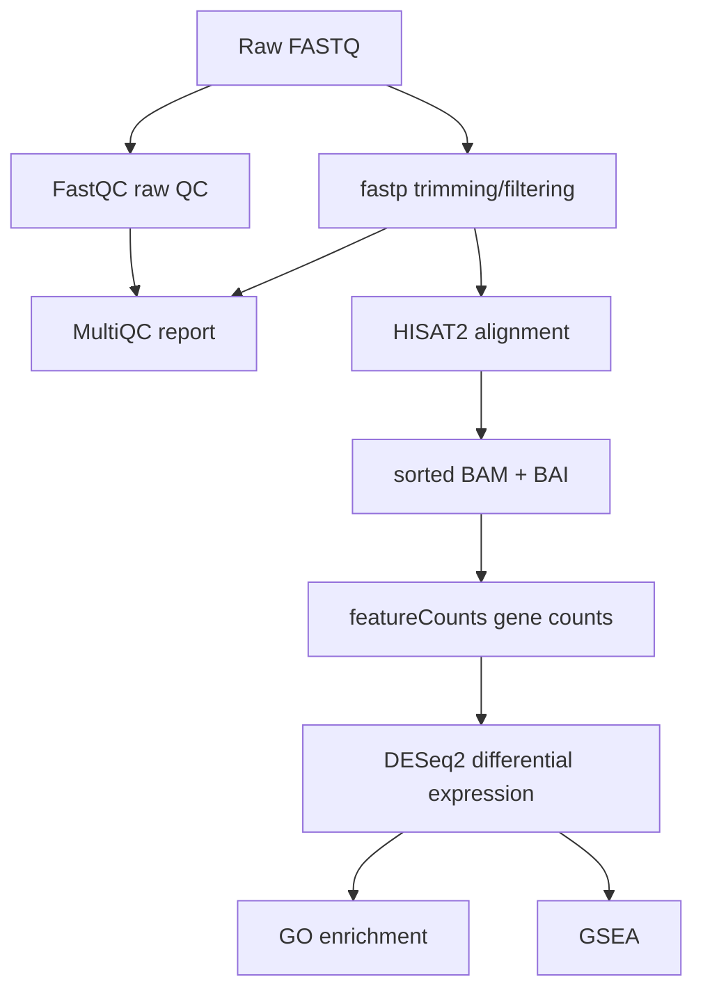

# Bulk RNA-seq Pipeline — JQ1 vs DMSO 

本项目用于分析 JQ1 处理 SUM159/SUM159R 三阴性乳腺癌细胞系后的 bulk RNA-seq 转录组变化，包含 3h 和 24h 两个时间点。项目从原始 FASTQ 数据开始，完成质量控制、reads 过滤、参考基因组比对、基因定量、差异表达分析、GO 富集分析和 GSEA 分析，最终生成可用于报告整理的表达矩阵、统计表格和图片结果。

流程支持两种运行方式：

1. 使用 `scripts/` 中的 Bash/R 脚本逐步运行。
2. 使用 Snakemake 从 FASTQ 到最终分析结果一键化运行。

其中 Snakemake 是推荐运行方式，适合复现完整分析、自动追踪文件依赖并支持断点续跑；Bash/R 脚本保留为模块化脚本版本，便于单独调试每一步。

## 目录结构

```
bulk_rnaseq/
├── Snakefile                  # Snakemake workflow
├── config/
│   ├── config.sh              # shell 脚本共用配置
│   ├── config.yaml            # Snakemake 主配置
│   └── samples_jq1.tsv        # 样本元数据，包括run_id, cell_line, time, treatment
├── scripts/
│   ├── 00_check_env.sh        # 环境检查
│   ├── 01_fastqc.sh           # 原始数据质控
│   ├── 02_fastp.sh            # 去接头，低质量修剪
│   ├── 03_multiqc.sh          # 汇总质控报告
│   ├── 04_hisat2_index.sh     # 构建 HISAT2 索引
│   ├── 05_hisat2_align.sh     # 比对到参考基因组
│   ├── 06_featurecounts.sh    # 基因计数
│   ├── 07_deseq2.R            # DESeq2 差异表达分析
│   ├── 08_go.R                # GO 富集分析
│   ├── 09_gsea.R              # GSEA 分析
│   └── lib.sh                 # 公共 bash 函数库
├── env/
│   └── conda_env.yaml         # 环境配置
├── tests/
│   └── data/
│       ├── fastq/             # 测试用 FASTQ
│       └── samples_test.tsv   # 测试用样本表
├── data/                      # 输入数据
│   ├── raw_fastq/
│   ├── trimmed_fastq/
│   └── reference/             # 参考基因组，HISAT2索引
├── results/                   # 输出结果
│   ├── qc/
│   ├── bam/
│   ├── counts/
│   ├── deseq2/
│   ├── go/
│   └── gsea/
└── logs/
```

## 分析流程



- **比较组**：JQ1 vs DMSO，分 3h 和 24h 两个时间点
- **参考基因组**：GRCh38, gencode v44 注释

## scripts/运行指南

### 1. 环境

```bash
conda env create -f env/conda_env.yaml
conda activate tnbc-rnaseq
bash scripts/00_check_env.sh
```

### 2. 准备参考基因组和输入数据

下载 GRCh38 参考序列和 gencode v44 GTF 放入 `data/reference/`，构建 HISAT2 索引：

```bash
bash scripts/04_hisat2_index.sh
```

原始 FASTQ 放入 `data/raw_fastq/`，路径需与 `config/samples.tsv` 中的 `fq` 列一致。

### 3. 运行

按编号顺序执行：

```bash
# 质控
bash scripts/01_fastqc.sh config/samples.tsv
bash scripts/02_fastp.sh config/samples.tsv
bash scripts/03_multiqc.sh config/samples.tsv

# 比对 + 计数
bash scripts/05_hisat2_align.sh config/samples.tsv
bash scripts/06_featurecounts.sh config/samples.tsv

# 差异表达 + 富集分析
Rscript scripts/07_deseq2.R
Rscript scripts/08_go.R
Rscript scripts/09_gsea.R
```

> **测试**：可先用 `tests/data/samples_test.tsv` 测试是否可以跑通流程。

### 4. 正式分析

使用真实数据进行分析

```
run_id	cell_line	time	treatment	fq
SRRxxx	SUM159	3h	DMSO	data/raw_fastq/SRRxxx.fastq.gz
...
```

如果更换物种，修改 `config/config.sh` 中的 `GENOME_FA`、`GTF`、`HISAT2_INDEX`，以及 R 脚本中的 `org.Hs.eg.db` ，改为对应物种的 `org.*.eg.db`。

## 输出

### 核心结果文件

| 路径 | 说明 |
|------|------|
| `results/deseq2/PCA.png` | PCA 图 |
| `results/deseq2/volcano_*.png` | 火山图（3h / 24h） |
| `results/deseq2/DESeq2_*.csv` | 全基因差异表达表 |
| `results/deseq2/DEG_*_all.csv` | 显著差异基因（padj<0.05, \|log2FC\|≥1） |
| `results/go/go_*.png` | GO 富集气泡图 |
| `results/go/go_*.csv` | GO 富集结果表 |
| `results/gsea/NES_heatmap_combined.png` | 3h+24h 合并 NES 热图 |
| `results/gsea/NES_trend.png` | NES 时间趋势折线图 |
| `results/gsea/GSEA_results_*.csv` | GSEA 结果表 |

## Snakemake运行指南
Snakemake 是本项目推荐的运行方式。它会根据输入和输出文件自动判断哪些步骤需要运行，支持断点续跑和模块化管理。

### 1.Snakemake流程

`Snakefile` 将完整 RNA-seq 分析拆分为多个相互连接的 rule。每个 rule 明确声明 `input`、`output`、`log`、`threads` 和 `shell`，因此 Snakemake 可以根据目标文件自动推导需要执行的步骤。

| Rule              | Main input                  | Main output                                    | Function                                      |
| ----------------- | --------------------------- | ---------------------------------------------- | --------------------------------------------- |
| `all`             | workflow 目标文件           | 无实际文件                                     | 定义完整流程最终需要生成的结果                |
| `sample_metadata` | `config/samples.tsv`        | `results/metadata/<run>.samples.cleaned.tsv`   | 清理并保存样本信息，供下游 R 脚本使用         |
| `fastqc_raw`      | 原始 FASTQ                  | `results/qc/<run>/fastqc/*_fastqc.html`        | 对原始 reads 进行质量评估                     |
| `fastp`           | 原始 FASTQ                  | `data/trimmed_fastq/<run>/*.trimmed.fastq.gz`  | 去除低质量 reads 和 adapter，生成过滤后 FASTQ |
| `multiqc`         | FastQC 和 fastp 报告        | `results/qc/<run>/multiqc/multiqc_report.html` | 汇总质控结果                                  |
| `hisat2_index`    | 参考基因组 FASTA            | `*.index.done`                                 | 构建 HISAT2 genome index                      |
| `hisat2_align`    | 过滤后 FASTQ + HISAT2 index | `results/bam/<run>/*.sorted.bam` 和 `.bai`     | 比对 reads 并生成排序 BAM                     |
| `featurecounts`   | sorted BAM + GTF            | `results/counts/<run>/gene_counts.tsv`         | 生成 gene-level raw count matrix              |
| `deseq2`          | count matrix + metadata     | `results/deseq2/.deseq2.done`                  | 运行差异表达分析并输出 PCA、火山图和 DEG 表格 |
| `go_enrichment`   | DESeq2 结果                 | `results/go/.go.done`                          | 对显著差异基因进行 GO 富集分析                |
| `gsea`            | DESeq2/GO 结果              | `results/gsea/.gsea.done`                      | 运行 GSEA 并绘制 NES 热图和趋势图             |

Snakemake 的依赖关系可以概括为：

```text
raw FASTQ
  ├── fastqc_raw ─┐
  └── fastp ──────┴── multiqc
       |
       └── hisat2_align
              |
              └── featurecounts
                       |
                       └── deseq2
                              ├── go_enrichment
                              └── gsea
```

### 2. Snakemake 运行
同scripts/运行，先搭建环境，如果已经搭建则可忽略。
```bash
conda env create -f env/conda_env.yaml
conda activate tnbc-rnaseq
```
请在项目根目录运行 Snakemake，常用命令如下：

```bash
# 1. 检查 workflow DAG，不真正运行
snakemake -s Snakefile -n --cores 8

# 2. 打印将要执行的 shell 命令
snakemake -s Snakefile -n --cores 8 --printshellcmds

# 3. 正式运行完整流程
snakemake -s Snakefile --cores 8
```
